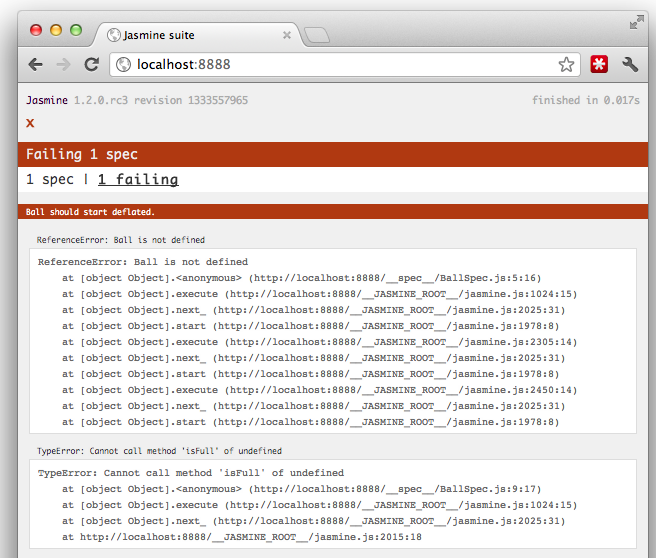
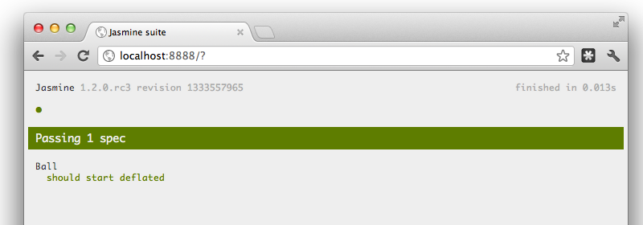
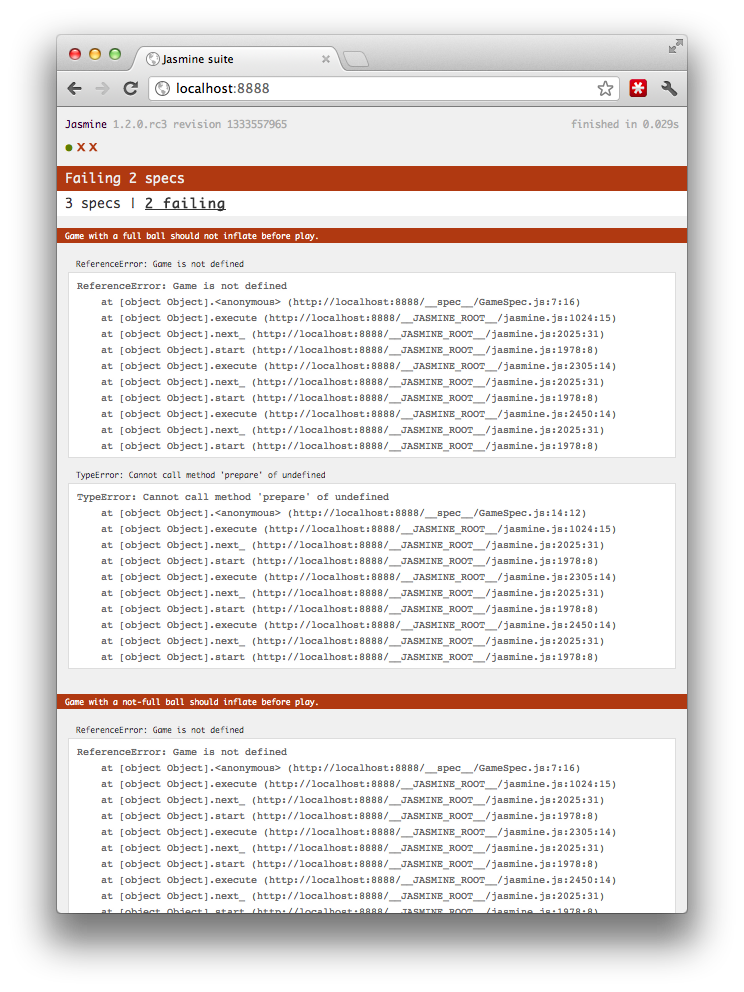
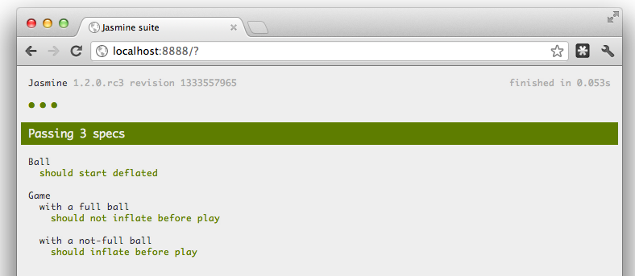
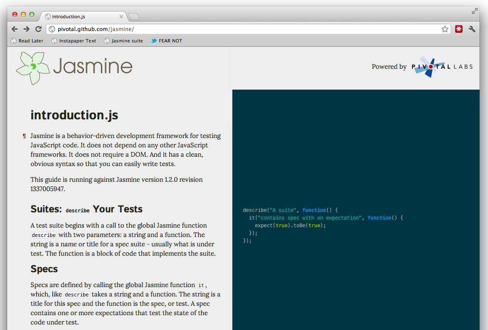

# 2012.05.30.JasmineIntroFluentConf

!SLIDE

 

# ...an Introduction

### [Davis W. Frank](http://dwf.bigpencil.net) | [@dwfrank](http://twitter.com/dwfrank) | [Pivotal Labs](http://pivotallabs.com)

!SLIDE

# `{}`

!SLIDE

# This used to be a comment

!SLIDE

# `{}`

!SLIDE

# This used to be a string

!SLIDE

# `{}`

!SLIDE 

# A "peasant's language"
### (apologies to [Dan Webb](http://danwebb.net))

!SLIDE

# `{}`

!SLIDE

# This was B$

!SLIDE

## Before $()

!SLIDE

# `{}`

!SLIDE

# _Turns out..._

!SLIDE

# JavaScript is _code_

!SLIDE

# `{}`

!SLIDE

# This is an object

!SLIDE

# Data...

!SLIDE

```javascript
{
  awesomeCount: 65536
}
```

!SLIDE

# & Behavior

!SLIDE

```javascript
{
  awesomeCount: 65536,
  moarAwesome: function() {
   this.awesomeCount++;
   return;
  }
}
```
!SLIDE

# Test Behavior

!SLIDE

# _Test Drive_ Behavior

!SLIDE

 

!SLIDE

# How?

!SLIDE

# Follow along at home

## [https://gist.github.com/2669482](https://gist.github.com/2669482)

!SLIDE

``` javascript
// BallSpec.js
describe("Ball", function () {
  var ball;
  
  beforeEach(function() {
    ball = new Ball();
  });
  
  it("should start deflated", function() {
    expect(ball.isFull()).toEqual(false);
  });
});
```

!SLIDE

 

!SLIDE

```javascript
// Ball.js
function Ball() {
  var full = false;

  this.inflate = function() {
    full = true;
  };

  this.isFull = function() {
    return full;
  };
}
```
!SLIDE

 

!SLIDE

# Matchers

`toBe(), toBeTruthy(), toBeDefined(), toMatch(), toContain(), toBeCloseTo(), toThrow(), ...`

!SLIDE middle

# Spies

## mocks, stubs, fakes, doubles

!SLIDE

```javascript
// GameSpec.js
describe("Game", function () {
  var game, ball;
  
  beforeEach(function() {
    ball = new Ball();
    spyOn(ball, 'inflate').andCallThrough();
    game = new Game();
  });
});
```

!SLIDE

```javascript
// GameSpec.js
describe("Game", function () {
  ...
  describe("with a not-full ball", function() {
    beforeEach(function() {
      game.prepare(ball);
    });

    it("should inflate before play", function() {
      expect(ball.inflate).toHaveBeenCalled();
    });
  });
});
```

!SLIDE

 

!SLIDE

```javascript
// Game.js
function Game() {
  this.prepare = function(ball) {
    if (ball.isFull()) {
      return;
    }
    ball.inflate();
  };
}
```
!SLIDE

 

!SLIDE

# The Mock Clock

!SLIDE

```javascript
describe("Manually ticking the Jasmine Mock Clock", function() {
  var timerCallback;

  beforeEach(function() {
    timerCallback = jasmine.createSpy('timerCallback');
    jasmine.Clock.useMock();
  });

  it("causes a timeout to be called synchronously", function() {
    setTimeout(function() {
      timerCallback();
    }, 100);

    expect(timerCallback).not.toHaveBeenCalled();
    jasmine.Clock.tick(101);
    expect(timerCallback).toHaveBeenCalled();
  });
});
```

!SLIDE

# [Jasmine Ajax](http://github.com/pivotal/jasmine-ajax)

!SLIDE

```javascript
describe("When using the Jasmine Ajax Mock", function() {
  var onSuccess, onComplete, onFailure, request;

  beforeEach(function() {
    onSuccess = jasmine.createSpy('onSuccess');
    onComplete = jasmine.createSpy('onComplete');
    onFailure = jasmine.createSpy('onFailure');
    
    jasmine.Ajax.useMock();

    jQuery.ajax({
      url:      "example.com/someApi",
      success:  onSuccess,
      complete: onComplete,
      error:    onFailure
    });
    request = mostRecentAjaxRequest();
  });

  it("prevents the call from leaving your system", function() {
    expect(request.url).toEqual("http://example.com/someApi");    
  });
```

!SLIDE

```javascript
describe("When using the Jasmine Ajax Mock", function() {
  var onSuccess, onComplete, onFailure, request;
  ... 
  describe("with a successful response", function() {
    beforeEach(function() {
      var successResponse = {
        status: 200,
        responseText: "w00t!"
      };
      request.response(successResponse);
    });

    it("should call the success callback", function() {
      expect(onSuccess).toHaveBeenCalledWith("w00t!");
    });

    it("should call the complete callback", function() {
      expect(onComplete).toHaveBeenCalled();
    });
  });
  ...
});
```

!SLIDE

```javascript
describe("When using the Jasmine Ajax Mock", function() {
  var onSuccess, onComplete, onFailure, request;
  ... 
  describe("with a successful response", function() {
    beforeEach(function() {
      var failureResponse = {
        status: 500,
        responseText: "Doh!"
      };
      request.response(failureResponse);
    });

    it("should call the failure callback", function() {
      expect(onFailure).toHaveBeenCalledWith("Doh!");
    });

    it("should call the complete callback", function() {
      expect(onComplete).toHaveBeenCalled();
    });
  })    
});
```

!SLIDE

# Async?

### `runs()` & `waitsFor()`

!SLIDE

# Rails?
## or Ruby-friendly

### `gem 'jasmine'`

!SLIDE 

# The Jasmine Gem

* Auto-inclusion of files
* Asset Pipeline support

!SLIDE

# Node.js?

### Yes, but could be better

!SLIDE bottom-left

# What does it _mean_, man?

}}} images/dude.jpg

!SLIDE

## Fix "broken windows"

!SLIDE

## Extract common behavior

!SLIDE

## Change implementations

!SLIDE

## Swap dependencies

!SLIDE

### Or, take it from [@izgaka](https://twitter.com/#!/izgaka/status/166700749655515136)

!SLIDE 

}}} images/fear_not.jpg

!SLIDE

# Help!

!SLIDE



!SLIDE

### [Jasmine](http://pivotal.github.com/jasmine/) at Github
### [tryjasmine.com](tryjasmine.com)
### [Mailing list](http://googlegroups.com/jasmine-js) at Google Groups

!SLIDE

# `{}`

!SLIDE

# This is _software_

!SLIDE 

 

## Make it green, keep	 it clean

!SLIDE

 

# Thanks!

### [Davis W. Frank](http://dwf.bigpencil.net) | [@dwfrank](http://twitter.com/dwfrank) | [Pivotal Labs](http://pivotallabs.com)

